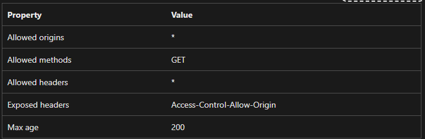

# 📊 Microsoft Fabric Excel Add-in

Welcome to the **Microsoft Fabric Excel Add-in**, a powerful tool that allows you to query data from a Microsoft Fabric SQL database and display it dynamically in Excel using custom functions.

---

## 🚀 Features
✅ Fetch real-time data from `[dbo].[fact_general_ledger]` in Microsoft Fabric SQL
✅ Use Excel Custom Functions to retrieve specific values like `Account Name`
✅ Seamless integration with Microsoft Excel for enhanced data analysis
✅ Secure authentication via Azure AD for API access.
✅ User-friendly task pane for manual queries and data management.

---

## 🛠 Prerequisites
Ensure you have the following installed before proceeding:

- **Node.js (Latest LTS version)** – Download from [Node.js official site](https://nodejs.org/)
- **Git** – Install from [Git official site](https://git-scm.com/)
- **Excel (Office 365 or Excel 2019+)** – Supports Office Add-ins
- **VS Code** (or any preferred IDE)

To verify the installation of Node.js and npm, run the following commands:

```bash
node -v
npm -v
```

---

## ⚡ Installation & Setup

### 1️⃣ Clone the Repository

```bash
git clone https://github.com/aamirhusnain/bmk-excel-add-in.git
cd bmk-excel-add-in
```

### 2️⃣ Install Dependencies

```bash
npm install
```

### 3️⃣ Start the Project

```bash
npm start
```

This will launch the Excel add-in in **Excel Desktop or Excel Online**.

---

## 📂 Project Structure

Below are the key files and their purposes:

- **`manifest.xml`** – Defines the add-in’s settings and capabilities.
- **`src/functions/functions.ts`** – Contains the Excel Custom Functions logic.
- **`src/taskpane/taskpane.html`** – Provides the user interface for manual queries.
- **`src/taskpane/components/`** – Houses React components and utilities for authentication, data handling, and Excel operations. 

---

# Front-End and Back-End Connection

The add-in connects the front-end(Excel interaface built with Js/Ts, React and Office.js) to the back-end (Microsoft Fabric SQL database and APIs) to enable secure data, retrieval and display. The connection is managed through HTTP request, OAuth 2.0 authentication via Azure AD, and a moduler codebase. We detail the back-end components and the specific fornt-end files responsible for this interaction.

## Back-End Components

### Microsoft Fabric SQL Database:

- Stores data in tables like [dbo].[fact_general_ledger], queried for entries such as Account Name or data objects by entry_no or entry_key.

### APIs:
- DATA_API_URL: Retrives data from the SQL database, requiring a valid access token.
- ECHANGE_TOKEN_URL: Exchanges Azure AD authorization codes for access and refresh tokens.
- REFRESH_TOKEN_URL: Refreshes expired acess tokens.
- Mircrosoft Graph API: Provides user information post-authenticaiton.

### Azure AD Authentication: 
- Secure API access using OAuth  2.0, issuing tokens for authenticated requests.
---

## Front-End Connection Files

## `.env`

- **Role:** Centralized configuration constants for API and authentication settings.
- **Connection:**
   - Defines clientId, tenantId, redirectUri, and scopes for Azure AD.
   - Specifies API endpoints: Data_API_URL, EXCHANGE_TOKEN_URL, REFRESH_TOKEN_URL.

- **Back-End Interaction:**
   - Provides UTLs for `auth.ts` to handle authentication and `data.ts` to query data.
   - **Interaction:**
      - Imported by `auth.ts` and `data.ts`.

---

## `src/taskpane/components/views/login.ts`

   - **Role:** Manages OAuth 2.0 authenticaiton with Azure AD.
   - **Connection:**
      -  `handleLogin:` Open an Office dialog for Azure AD login, receiving an authorization code.
      - `fetchTokensWithCode:` Send the code to EXCHANGE_TOKEN_URL to obtain access/refresh tokens.
      - `checkAndRefreshToken:` Validates tokens, refreshing via REFRES_TOKEN_URL if expired.
      - `fetchUserInfo:` Queries Graph API for user details using access tokens.
      -  `storeTokenData` Saves tokens to localStorage.

   - **Back-End Interaction:**
      - Communicates with token APIs and Graph API to secure access for data requests.
   
   - **Interactions:**
      -  Uses `.env` for URLs/scopes; provides token to `data.ts`; updates `App.tsx` with status.

---

## `src/taskpane/components/utlis/data.ts`

   - **Role:** Fetches, caches, and formats data from back-end APIs.
   - **Connection:**
      - `fetchData:` Calls DATA_API_URL with `auth.ts` tokens, caching results to avoid redundant requests.
      - `formateObjectForExcel:` Converts API responses into 2D arrays for Excel.
      - `searchByEntryNo:` Searches data by entry_no or enter_key for specific entries.

   - **Back-End Interaction:**
      -  Queries [dbo].[fact_general_ledger] via DATA_API_URL.
   
   - **Interaction:**
      - Used `.env` for URLs, `auth.ts` for tokens; feeds `excel.ts` and `functions.js`.

---

## `src/taskpane/components/utlis/excel.ts`

   - **Role:** Integrates back-end data into Excel using Office.js.
   - **Connection:**
      - `handleInsertData:` Fetches data via `data.ts` and inserts it into worksheets.
      - `handleRefreshData:` Updates Excel with fresh API data.
      - `refreshFormulas:` Recalculates workbook to relfect updates.
   
   - **Back-End Interaction:**
      -  Indirectly uses API data through `data.ts`.
   
   - **Interactions:**
      - Depends on `data.ts`; triggered by `App.tsx`.

---

## `src/functions/functions.js`

   - **Role:** Defines custom functions.
   - **Connections:**
      - Queries DATA_API_URL via `data.ts` for cell-level data using `entry_no/entry_key`.
      -  Uses `auth.ts` tokens for secure requests.

   - **Back-End Interactions:**
      -  Retrieves specific SQL data for Excel cells.
   
   - **Interacitons:**
      -  Relies on `data.ts` and `auth.ts`.

---

## `src/taskpane/compoenents/App.tsx:`

   - **Role** Orchestrates UI and logic with React and React Routere.
   - **Connection:**
      - Renders task pane buttons for login, data insertion, and refresh.
      - Manages UI state based on `auth.ts`, `data.ts`, `excel.ts` feedback.

   - **Back-End Interaction:**
      - Indirectly triggers API calls via other files.
   
   - **Interactions:**
      -  Coordinates `auth.ts`, `data.ts`, `excel.ts`.

---

## `src/taskpane/index.tsx:`

   - **Role:** Initializes the add-in and sets up event listeners.

   - **Connection:**
      - Initializes Office.js and triggers `auth.ts` for token checks.
      - Binds task pane actions to `auth.ts`, `data.ts`, `excel.ts` funcitons.

   - **Back-End Interaction:**
      - Indirectly starts authetication and data fetching.
   
   - **Interactions:**
      - Imports `App.tsx`, `auth.ts`, `data.ts`, `excel.ts`.

---

# Conncetion Workflow
   -  **Initializatino( index.tsx, App.tsx)**
      - `index.tsx` loads Office.js; `App.tsx` renders UI.
      - `auth.ts` checks for existing tokens.

   -  **Authentication( auth.ts, .env)**
      - `auth.ts` uses .env settings to open Azure AD login, exchange code at EXCHANGE_TOKEN_URL, and refresh token at REFRESH_TOKEN_URL.

   -  **Data Retrievel( data.ts, auth.ts, .env)**
      -  `data.ts` uses `auth.ts` token and `.env` DATA_API_URL to fetch SQL data, caching results.

   -  **Excel Integration( exce.ts, functions.js)**
      - `excel.ts` inserts `data.ts` results into worksheets.
      - `functions.js` delivers API data to cells.

   -  **UI Updates(App.tsx)**
      - `App.tsx` reflects status form all files.

---

# File Descriptions

This section explains the purpose and functionality of each JavaScript file in the `src/` directory of the Excel add-in project. The codebase has been modularized from a single `index.tsx` file into separate files, each with a distinct responsibility, to improve maintainability, scalability, and readability. Below, each file is described in terms of its role, key functions, and how it interacts with other parts of the application.

---

## `.env`

### Purpose
`.env` serves as the central repository for configuration constants used throughout the application. It defines static values such as authentication credentials, API endpoints, and scopes, making them easily accessible and editable in one place.

### What It Does
- Stores configuration data like `clientId`, `tenantId`, `redirectUri`, API URLs, and OAuth scopes.
- Ensures sensitive information is not hard-coded in the source files, promoting security and maintainability.
- Provides a single source of truth for all environment-specific variables, making it easier to manage different environments (development, staging, production).


### Key Content
- **Constants:**
  - `clientId`: The application's Azure AD client ID.
  - `tenantId`: The Azure AD tenant ID.
  - `redirectUri`: The URL where the authentication redirect occurs.
  - `scopes`: The permissions requested during authentication (e.g., `User.Read`).
  - `DATA_API_URL`, `REFRESH_TOKEN_URL`, `EXCHANGE_TOKEN_URL`: Backend API endpoints.

### Interactions
- Imported by `auth.ts` for authentication URLs and scopes.
- Imported by `data.ts` for API endpoint URLs.

---

## `src/taskpane/components/services/auth.ts`

### Purpose
`auth.ts` handles all authentication-related functionality, including login, logout, token management, and user information retrieval using Microsoft Azure AD and the Graph API.

### What It Does
- Manages the OAuth 2.0 authentication flow with Microsoft identity services.
- Refreshes access tokens when they expire.
- Fetches and displays user information from the Graph API.
- Handles logout by clearing tokens and resetting the UI.

### Key Functions
- `checkAndRefreshToken()`: Verifies if the current token is valid or refreshes it using a refresh token.
- `performTokenRefresh(refreshToken)`: Requests a new access token from the backend.
- `handleLogin()`: Opens an Office dialog for Azure AD login and processes the authorization code.
- `fetchTokensWithCode(code)`: Exchanges an authorization code for access and refresh tokens.
- `handleLogout()`: Clears tokens and transitions to the logged-out state.
- `fetchUserInfo()`: Retrieves and displays the user’s name from the Graph API.
- `storeTokenData(data)`: Saves tokens and expiry time to `localStorage`.

### Interactions
- Imports `.env` for authentication URLs and scopes.
- Imports `App.tsx` for status updates and UI transitions.
- Used by `data.ts` to ensure valid tokens before API calls.
- Called by `login.tsx` for login/logout event handlers and initial auth checks.

---

## `src/taskpane/components/utlis/data.ts`

### Purpose
`data.ts` is responsible for fetching, caching, and processing data from the backend API. It formats data for display in Excel and searches for specific entries based on user input.

### What It Does
- Fetches data from the backend API, caching it to avoid redundant requests.
- Formats individual data entries into a key-value pair structure for Excel.
- Searches the cached data for entries matching a given `entry_no`.

### Key Functions
- `fetchData(forceRefresh)`: Retrieves data from the API, using the cache unless a refresh is forced; manages spinner visibility and status updates.
- `formatObjectForExcel(entry)`: Converts a data object into a 2D array of labeled values, handling special cases like dates and numbers.
- `searchByEntryNo(entryNoString)`: Searches the data for an entry by `entry_no` and returns formatted results or an error message.

### Interactions
- Imports `.env` for the `DATA_API_URL`.
- Imports `home.tsx` for status updates and control management.
- Imports `auth.ts` to check and refresh tokens before API calls.
- Used by `excel.ts` to fetch and format data for insertion.
- Called by `home.tsx` for initial data loading.

---

## `src/taskpane/components/utlis/excel.ts`

### Purpose
`excel.ts` contains all Excel-specific operations using the Office.js API, such as inserting data into worksheets and refreshing formulas.

### What It Does
- Inserts formatted data into the active Excel worksheet.
- Refreshes data in Excel by fetching the latest from the API and updating the sheet.
- Forces a full recalculation of Excel formulas.

### Key Functions
- `handleInsertData()`: Fetches data for the entered `entry_no` and inserts it into Excel with formatting.
- `handleRefreshData()`: Refreshes the data source and updates Excel with the latest entry data.
- `refreshFormulas()`: Triggers a full recalculation of the workbook.

### Interactions
- Imports `home.tsx` for status updates and control management.
- Imports `data.ts` to fetch and format data.
- Called by `home.tsx` for button event handlers.

---

### Interactions
- Imported by `auth.ts`, `data.ts`, and `excel.ts` to sanitize strings before displaying them in the UI (e.g., user names, error messages).
- Not directly used by `home.tsx`, but supports other modules indirectly.

---

## `src/taskpane/index.tsx`

### Purpose
`index.tsx` is the entry point of the application, responsible for initializing the add-in, setting up event listeners, and orchestrating the other modules. It ties everything together without implementing detailed logic itself.

### What It Does
- Initializes the Office.js environment and checks if the host is Excel.
- Sets up event listeners for UI buttons (login, logout, insert data, refresh data, refresh formulas).
- Performs an initial authentication check and updates the UI accordingly.
- Triggers initial data fetching and user info retrieval on successful login.

### Key Content
- `Office.onReady()`: Runs when Office.js is ready, setting up the add-in.
- **Event Listeners**: Bind button clicks to functions from `auth.ts`, `excel.ts`, etc.
- **Initial Setup**: Checks authentication, updates UI, and fetches initial data/user info.

### Interactions
- Imports `home.ts` for DOM access and UI management.
- Imports `auth.ts` for login/logout and user info.
- Imports `data.ts` for initial data fetching.
- Imports `excel.ts` for Excel operation handlers.
- Serves as the central hub, delegating tasks to other modules.

---

## `src/taskpane/components/App.tsx`

### Purpose
- We use React Router to enable navigation within a single-page React application (SPA) without full page reloads, allowing for a smoother, more dynamic user experience by managing URLs and rendering different components based on the current rout

---

## `src/web.config`

### Purpose
- This CORS configuration assumes all files on your server are publicly available to all domains.

### Deploy custom functions for Excel
If your add-in has custom functions, there are a few more steps to enable them on the Azure Storage account. First, enable CORS so that Office can access the functions.json file.

Right-click (or select and hold) the Azure storage account and select Open in Portal.

In the Settings group, select Resource sharing (CORS). You can also use the search box to find this.

Create a new CORS rule for the Blob service with the following settings.


---

## How They Work Together
- `.env` provides static values used by `auth.ts` and `data.ts`.
- `App.tsx` acts as the UI controller, used by all modules to update the interface and manage controls.
- `auth.ts` ensures the user is authenticated, providing tokens for `data.ts` and user info for `home.tsx`.
- `data.ts` fetches and processes data, relying on `auth.ts` for tokens and supplying `excel.ts` with formatted results.
- `excel.ts` interacts with Excel, using `data.ts` for content and `home.tsx` for feedback.
- `index.tsx` initializes the app, connects user actions to module functions, and coordinates the initial state.

This modular structure ensures each file has a clear role, with `App.tsx` orchestrating the flow while keeping implementation details in their respective domains.

---

## 🧮 Using Custom Functions in Excel

The add-in provides custom functions to fetch data directly into Excel. Here’s how you can use them:

### Get Account Name by Entry Number or Entry Key

Use the formula below in an Excel cell:

```excel
=BMK.GETACCOUNTNAME(entry_key)
```
🔹 **entry_no** or **entry_key** should be replaced with the actual numeric value.
🔹 The function will return the **Account Name** associated with the provided entry.

### Get data object by Entry Number or Entry Key

Use the formula below in an Excel cell:

```excel
=BMK.SEARCHBYENTRYNO(entry_no)
```

or

```excel
=BMK.SEARCHBYENTRYKEY(entry_key)
```

🔹 **entry_no** or **entry_key** should be replaced with the actual numeric value.
🔹 The function will return the **DATA Object** associated with the provided entry.

### do you want to change custom functions base name BMK?

- if you want to change custom functions base name from BMK to another ABC e.tc
- go into the manifest file at the bottom find ShortStrings section and change the Functions.Namespace value

---

## 🚀 Deploying the Add-in

Follow these steps to deploy your add-in:

1. **Build the project**:

   ```bash
   npm run build
   ```

   After a successful build, the `dist` folder will contain the deployment files.

2. **Host the files**:
   Upload the contents of the `dist` folder to any hosting service (e.g., **GitHub Pages, Azure, AWS, Netlify**).

3. **Update the manifest file**:
   Replace all occurrences of `https://localhost:3000/` with your live deployment URL.

### Example Update:

Replace:

```xml
https://localhost:3000/
```

With:

```xml
https://your-live-url.com/
```

---

## 📝 Additional Resources

- 📖 [Microsoft Office Add-ins Documentation](https://learn.microsoft.com/en-us/office/dev/add-ins/)
- 🚀 [Deploying Office Add-ins](https://learn.microsoft.com/en-us/office/dev/add-ins/publish/publish-add-in-vs-code)

---

